# FINAL YEAR PROJECT REPORT

## TITLE PAGE

**Project Title:** WealthFlow - AI-Driven Financial Advisor, Trading Simulator, and Market Intelligence Platform  
**Student Name:** [Student Name]  
**Registration Number:** [Registration Number]  
**Department:** [Department]  
**University:** [University Name]  
**Supervisor:** [Supervisor Name]  
**Submission Date:** May 10, 2026  

---

## APPROVAL PAGE

This report titled **"WealthFlow - AI-Driven Financial Advisor, Trading Simulator, and Market Intelligence Platform"** has been reviewed and approved in partial fulfillment of the requirements for the Final Year Project.

**Supervisor Signature:** ____________________  
**Date:** ____________________  

---

## DECLARATION

I hereby declare that this Final Year Project report and the associated software system are my original work, carried out under the supervision of the named supervisor. All sources used have been properly acknowledged in accordance with IEEE referencing guidelines.

**Student Signature:** ____________________  
**Date:** ____________________  

---

## ACKNOWLEDGEMENT

I express my sincere gratitude to my supervisor for guidance and continuous support throughout the project. I also acknowledge the contributions of my peers and the maintainers of the open-source tools, APIs, and documentation that enabled the successful completion of this work.

---

## ABSTRACT

WealthFlow is a full-stack financial platform that integrates a portfolio dashboard, trading simulator, market news intelligence, and a personalized AI financial advisor. The system addresses the need for accessible, context-aware investment decision support by combining real-time market data with user portfolio analytics and retrieval-augmented generation (RAG). The implementation leverages Next.js and React for the user interface, Hono as the backend API framework, Supabase PostgreSQL with Prisma ORM for persistence, Better Auth for session-based authentication, and Upstash Redis for caching and rate control. The AI advisor integrates Groq LLM inference with structured investor profiles, portfolio holdings, and a pgvector-backed knowledge base built from company profiles, financial metrics, news, and SEC filings. This report details the architecture, design rationale, database schema, API design, algorithms, and implementation choices, while evaluating system reliability, performance, and usability. Testing includes API smoke tests and RAG ingestion validation, with findings documented and limitations identified. The result is a modular, extensible financial platform suitable for academic evaluation and future production hardening.

---

## TABLE OF CONTENTS

1. Introduction  
1.1 Background and Motivation  
1.2 Problem Statement  
1.3 Project Objectives  
1.4 Scope and Boundaries  
1.5 Significance of the Project  
1.6 Target Users  
1.7 Project Overview  
1.8 Methodology Overview  
1.9 Report Organization  

2. Related Work  
2.1 Robo-Advisors and Portfolio Management Systems  
2.2 Trading Simulators and Market Sandboxes  
2.3 RAG-Based Financial Assistants  
2.4 Comparative Analysis  
2.5 Research Gaps and Differentiation  

3. Requirements Analysis  
3.1 Functional Requirements  
3.2 Non-Functional Requirements  
3.3 System Requirements  
3.4 Hardware Requirements  
3.5 Software Requirements  
3.6 User Requirements and Personas  
3.7 Use Case Analysis  
3.8 User Stories  
3.9 Feasibility Analysis  
3.10 Constraints  

4. System Design  
4.1 Architecture Overview  
4.2 Frontend Architecture  
4.3 Backend Architecture  
4.4 Data Layer Design  
4.5 API Design and Routing  
4.6 Authentication and Authorization Flow  
4.7 State Management and Caching  
4.8 RAG Pipeline Design  
4.9 Algorithm Design and Data Processing  
4.10 Deployment Architecture  
4.11 Security Design  
4.12 UI/UX Design Principles  

5. Implementation  
5.1 Project Setup and Repository Structure  
5.2 Next.js App Router and Layouts  
5.3 Hono Integration with Next.js  
5.4 Authentication Implementation  
5.5 AI Advisor and Chat Streaming  
5.6 RAG Ingestion and Retrieval  
5.7 Trading Simulator Implementation  
5.8 Portfolio Analytics Implementation  
5.9 Market News and Data Integration  
5.10 UI Components and Visualization  
5.11 Error Handling and Observability  
5.12 Performance Optimization  
5.13 Security Implementation  
5.14 Deployment and Configuration  

6. Testing and Evaluation  
6.1 Testing Strategy  
6.2 Unit and Integration Testing  
6.3 API Testing and Smoke Tests  
6.4 UI Testing and Usability Checks  
6.5 Performance and Rate-Limit Evaluation  
6.6 Security Validation  
6.7 Debugging and Bug Fixing Summary  
6.8 Evaluation Metrics and Results  

7. Conclusion and Future Work  
7.1 Project Achievements  
7.2 Lessons Learned  
7.3 Limitations  
7.4 Future Enhancements  
7.5 Research Opportunities  

References  
Appendices  

---

## LIST OF FIGURES

Figure 1: High-Level System Architecture  
Figure 2: Frontend Component Diagram  
Figure 3: Backend Module Diagram  
Figure 4: Authentication Sequence Diagram  
Figure 5: AI Advisor Streaming Sequence Diagram  
Figure 6: RAG Ingestion Pipeline Flowchart  
Figure 7: Trading Simulator Order Lifecycle  
Figure 8: Deployment Diagram  
Figure 9: Database ER Diagram  
Figure 10: API Gateway Flow (Next.js + Hono)  
Figure 11: News Personalization Flow  
Figure 12: Portfolio Analytics Data Flow  
Figure 13: Pending Order Processing Flow  
Figure 14: RAG Search and Rerank Flow  

---

## LIST OF TABLES

Table 1: Technology Stack Summary  
Table 2: Functional Requirements  
Table 3: Non-Functional Requirements  
Table 4: Use Case Catalog  
Table 5: Module-to-API Mapping  
Table 6: Test Cases and Results  
Table 7: Rate Limit and Cache Settings  
Table 8: Environment Variables  
Table 9: Data Entities and Purpose  
Table 10: RAG Retrieval Scoring Components  
Table 11: Use Case Descriptions  
Table 12: Deployment Commands and Scripts  
Table 13: Manual UI Verification Checklist  

---

# 1. INTRODUCTION

## 1.1 Background and Motivation
Financial literacy and access to market intelligence remain uneven across investor segments. Many retail investors rely on fragmented tools that separately provide quotes, news, education, and portfolio tracking. Meanwhile, recent advances in large language models (LLMs) enable conversational interfaces capable of summarizing financial data and assisting in decision-making, but these systems often lack portfolio context and evidence-based explanations. WealthFlow is motivated by the need to unify portfolio analytics, simulator-based learning, and AI-driven guidance in a single platform that is technically coherent and extensible [1]-[3].

## 1.2 Problem Statement
Traditional dashboards provide metrics without explanations, while general-purpose AI assistants provide explanations without the actual portfolio context or verifiable sources. This creates a gap where advice is either decontextualized or untrusted. The challenge is to build a platform that integrates user-specific holdings, investor profile data, and market sources into a conversational interface while maintaining performance, security, and modularity.

## 1.3 Project Objectives
- Build a unified fintech platform with portfolio analytics, trading simulation, and an AI advisor.
- Integrate real-time market data with caching and rate-limit control.
- Implement retrieval-augmented generation using pgvector and document ingestion pipelines.
- Provide session-based authentication and secure access control.
- Deliver a responsive, dashboard-centric UI with data visualization and real-time chat streaming.

## 1.4 Scope and Boundaries
The system focuses on four primary domains: AI advisor, trading simulator, portfolio analytics, and market news. A learning hub UI is present but not fully connected to a dynamic backend content pipeline. The AI advisor provides informational guidance and includes explicit disclaimers for educational use. Deployment is designed for Next.js-compatible serverless environments and depends on third-party APIs for market data.

## 1.5 Significance of the Project
WealthFlow demonstrates a practical integration of LLM-based guidance with real portfolio context and RAG. It is significant as a reference architecture for academic teams seeking to build evidence-grounded AI systems in finance, balancing technical sophistication with deployable system design.

## 1.6 Target Users
- Beginner investors seeking simplified explanations and portfolio guidance.
- Intermediate investors requiring analytics, sector allocation, and trend tracking.
- Students and researchers evaluating AI-driven decision support systems.

## 1.7 Project Overview
The frontend is built on Next.js (App Router) and provides a dashboard-centric UI with modular views for chat, portfolio, simulator, and news. The backend uses Hono and Prisma for routing and persistence, and Upstash Redis for caching. The AI advisor integrates Groq LLM inference with portfolio context and RAG retrieval via pgvector. A background scheduler processes pending simulator orders and triggers periodic RAG refresh ingestion, controlled by environment flags.

### 1.7.1 Module Summary
- **AI Financial Advisor:** Conversational chat with session history, streaming output, and RAG-backed citations.
- **Trading Simulator:** Virtual portfolio, pending orders, market status checks, and performance snapshots.
- **Portfolio Analytics:** Real holdings with live quotes, PnL computation, and sector allocation.
- **Market News:** Personalized feed based on holdings and watchlist with provider fallbacks.
- **RAG Service:** Ingestion of profiles, news, financials, and SEC filings into pgvector.

### 1.7.2 Data and AI Flow (Narrative)
1. User authenticates and navigates to the dashboard.
2. Portfolio data is fetched and enriched with live quotes.
3. The AI advisor builds a system prompt with holdings, investor profile, and retrieved sources.
4. The response is streamed to the UI via SSE and persisted in PostgreSQL.
5. Background ingestion refreshes RAG data for active tickers on a schedule.

## 1.8 Methodology Overview
The methodology follows a staged software engineering process: requirements analysis, modular design, implementation of core services, integration of AI and RAG, and iterative validation. Documentation and setup guides were maintained alongside development to support reproducibility.

### 1.8.1 Iterative Development Steps
- **Phase 1:** Core data layer and authentication (Prisma + Better Auth).
- **Phase 2:** Trading simulator and portfolio analytics (Hono services + SWR).
- **Phase 3:** AI advisor integration (Groq streaming + chat persistence).
- **Phase 4:** RAG ingestion and retrieval (pgvector + Gemini embeddings).
- **Phase 5:** UX refinement and bug fixes (chat history, markdown, auto-scroll).

## 1.9 Report Organization
The report is structured into seven chapters: related work, requirements, design, implementation, testing, and conclusion. Each chapter is tied to evidence in the codebase and supported by diagrams and code excerpts.

### 1.9.1 Evidence Traceability
Implementation details are aligned with actual modules and code paths (advisor, trading, portfolio, news, rag). This ensures the report reflects the deployed architecture rather than generic assumptions.

---

# 2. RELATED WORK

## 2.1 Robo-Advisors and Portfolio Management Systems
Robo-advisors apply automated portfolio theory to deliver allocation and rebalancing recommendations based on risk profiles [10], [11]. These systems typically abstract market details and provide limited transparency into the data sources. WealthFlow builds on the portfolio-aware approach but adds verifiable sources via RAG and real-time data streams.

### 2.1.1 Limitations in Conventional Robo-Advisors
Most robo-advisors focus on long-horizon allocation and rarely expose the provenance of their recommendations. Without explicit citations, end users may struggle to trust advice, especially in volatile markets. WealthFlow addresses this limitation by integrating retrieval sources into AI responses, enabling contextualized and transparent explanations.

### 2.1.2 Portfolio Analytics Evolution
Modern platforms increasingly include portfolio analytics such as sector allocation, concentration risk, and performance snapshots. WealthFlow implements these metrics directly in its portfolio service using live quotes and historical snapshots, aligning with industry expectations while retaining full transparency in the data flow.

## 2.2 Trading Simulators and Market Sandboxes
Trading simulators provide controlled environments for practice but often lack integrated analytics or AI guidance. WealthFlow integrates the simulator into the same data and analytics pipeline used for real portfolios, allowing the AI advisor to reason across simulated and real holdings.

### 2.2.1 Educational Value and Feedback Loops
Effective simulators require feedback loops that explain the outcome of decisions. WealthFlow enhances simulator usability by providing real-time analytics and the ability to query the AI advisor with the same market context used for actual portfolios.

## 2.3 RAG-Based Financial Assistants
RAG improves factual consistency by grounding responses in retrieved documents [12]. In finance, retrieval must account for document type, recency, and relevance (e.g., SEC filings vs. market news). WealthFlow implements metadata filters and reranking logic to prioritize filings for regulatory questions and news for market context [8], [9].

### 2.3.1 Retrieval and Reranking in Finance
Financial queries often demand high-precision evidence. WealthFlow uses metadata-aware filtering and hybrid reranking to combine vector similarity with keyword overlap and recency, while applying domain-specific boosts for SEC filings. This design reduces the likelihood of irrelevant citations and aligns with best practices in RAG systems [12].

## 2.4 Comparative Analysis
**Table 1: Technology Stack Summary**

| Layer | WealthFlow | Common Alternative | Rationale |
| --- | --- | --- | --- |
| Frontend | Next.js + React | React + Express | App Router, SSR-ready [1], [2] |
| Backend | Hono | Express | Minimal, fast, edge-ready [3] |
| Database | Supabase Postgres | MySQL/MongoDB | Relational schema + pgvector [4], [9] |
| ORM | Prisma | Sequelize | Type-safe schema, migrations [5] |
| Auth | Better Auth | NextAuth | Plugin-based auth and organizations [6] |
| LLM | Groq Llama 3.3 | OpenAI GPT | High-speed inference [7] |
| Embeddings | Gemini | OpenAI embeddings | Multi-model choice, fallback [13] |
| Cache | Upstash Redis | Local memory | Serverless Redis + TTL [14] |

**Table 1a: Feature Comparison with Related Systems**

| Feature | Typical Robo-Advisor | Trading Simulator | WealthFlow |
| --- | --- | --- | --- |
| Portfolio Analytics | Yes | Limited | Yes (live + snapshots) |
| AI Advisor | Limited | No | Yes (portfolio-aware) |
| RAG Citations | No | No | Yes (pgvector) |
| Simulator Trades | No | Yes | Yes |
| News Personalization | Partial | No | Yes |

## 2.5 Research Gaps and Differentiation
Existing systems either provide analytics without AI reasoning or conversational AI without evidence and portfolio context. WealthFlow differentiates by combining structured investor profiles, live portfolio data, and RAG-backed evidence into a single system, enabling personalized, explainable financial guidance.

---

# 3. REQUIREMENTS ANALYSIS

## 3.1 Functional Requirements
**Table 2: Functional Requirements**

| ID | Requirement | Description |
| --- | --- | --- |
| FR-1 | User Authentication | Users must sign up, sign in, and maintain sessions. |
| FR-2 | Portfolio Overview | Display holdings, total value, and unrealized PnL. |
| FR-3 | Trading Simulator | Execute simulated trades with pending orders. |
| FR-4 | Market Data | Fetch quotes, candles, profiles, and news. |
| FR-5 | AI Advisor | Provide conversational financial guidance. |
| FR-6 | RAG Retrieval | Retrieve documents from pgvector store. |
| FR-7 | Chat Sessions | Persist sessions and history. |
| FR-8 | News Feed | Provide market and personalized news. |
| FR-9 | Investor Profile | Capture risk tolerance and goals. |
| FR-10 | Portfolio Analytics | Sector allocation and performance snapshots. |
| FR-11 | Watchlist Alerts | Manage simulated watchlist items. |

### 3.1.1 Functional Requirement Details
- **FR-2 Portfolio Overview:** Must aggregate holdings, compute live PnL, and show sector allocation.
- **FR-3 Trading Simulator:** Must support buy/sell trades, pending orders when market is closed, and snapshots.
- **FR-5 AI Advisor:** Must inject portfolio and investor profile context into prompts and return SSE streams.
- **FR-6 RAG Retrieval:** Must search vector data with metadata filters and return citations.

## 3.2 Non-Functional Requirements
**Table 3: Non-Functional Requirements**

| ID | Requirement | Target |
| --- | --- | --- |
| NFR-1 | Availability | 99 percent uptime in development environment |
| NFR-2 | Performance | < 2s average API response for cached calls |
| NFR-3 | Scalability | Modular scaling of services |
| NFR-4 | Security | Session-based authorization |
| NFR-5 | Maintainability | Clear service boundaries and typed APIs |
| NFR-6 | Explainability | AI responses cite retrieved sources |
| NFR-7 | Reliability | Graceful fallbacks on provider limits |

## 3.3 System Requirements
- Modern browser with ES6 support.
- Internet access for external APIs.
- Node.js or Bun runtime for development.

### 3.3.1 Network Dependencies
The platform depends on multiple external services (Groq, Finnhub, Alpha Vantage, Gemini). Network connectivity must be stable to avoid downstream timeouts. Redis caching mitigates transient failures and reduces provider call frequency.

## 3.4 Hardware Requirements
- 8 GB RAM, 2-core CPU for development.
- SSD storage for dependency and build artifacts.

## 3.5 Software Requirements
- Next.js 15.x, React 19.x [1], [2].
- Prisma ORM 6.x [5].
- Supabase PostgreSQL with pgvector extension [4], [9].
- Better Auth session management [6].
- Hono web framework [3].
- Upstash Redis for caching [14].

## 3.6 User Requirements and Personas
- **Persona A (Beginner):** Needs simplified explanations and risk-averse recommendations.
- **Persona B (Intermediate):** Requires analytics, sector breakdowns, and trend tracking.
- **Persona C (Student):** Uses simulator to practice trading without capital risk.

**Persona Summary Table**

| Persona | Primary Need | Features Used |
| --- | --- | --- |
| Beginner | Education + low-risk advice | AI advisor, learning UI, news |
| Intermediate | Analytics + insights | Portfolio dashboard, advisor, news |
| Student | Practice environment | Simulator, market data |

## 3.7 Use Case Analysis
**Table 4: Use Case Catalog**

| Use Case | Actors | Description |
| --- | --- | --- |
| UC-1 | User | Sign up and authenticate |
| UC-2 | User | View portfolio overview |
| UC-3 | User | Execute a simulated trade |
| UC-4 | User | Ask AI advisor a question |
| UC-5 | User | Retrieve personalized news |
| UC-6 | System | Auto-process pending orders |
| UC-7 | User | Update investor profile |

**Use Case Diagram**

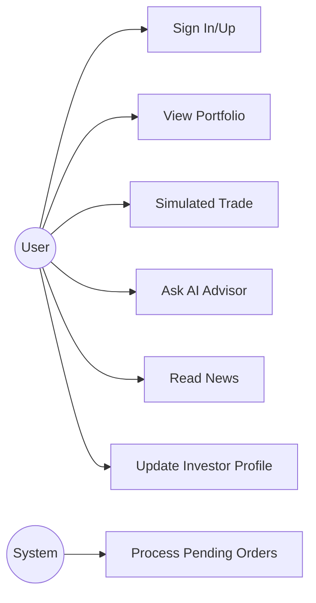

**Table 11: Use Case Descriptions**

| Use Case | Precondition | Main Flow | Postcondition |
| --- | --- | --- | --- |
| UC-3 | User authenticated | Submit trade -> check market status -> execute or queue | Transaction recorded |
| UC-4 | User authenticated | Send chat -> retrieve context -> stream reply | Message saved |
| UC-7 | User authenticated | Update profile via modal | Profile stored |

## 3.8 User Stories
- As a user, I want to view my holdings with live pricing so that I can track performance.
- As a user, I want the AI advisor to explain trade ideas using real data and citations.
- As a learner, I want a simulator to practice trading without financial risk.

## 3.9 Feasibility Analysis
- **Technical:** Stack uses proven frameworks and cloud services.
- **Operational:** External API rate limits are mitigated by caching and fallbacks.
- **Economic:** Free tiers of Groq, Finnhub, and Supabase are sufficient for academic scope.

## 3.10 Constraints
- Rate limits from Finnhub and Alpha Vantage restrict high-frequency usage.
- RAG quality depends on successful ingestion and embeddings availability.
- The learning module is UI-centric and lacks a full content pipeline.

---

# 4. SYSTEM DESIGN

## 4.1 Architecture Overview
WealthFlow combines a Next.js frontend with a Hono backend exposed through the Next.js API route. The system uses PostgreSQL as the primary database and pgvector for RAG retrieval. Redis provides caching for market data.

**Figure 1: High-Level System Architecture**

```mermaid
flowchart TB
  subgraph Client
    UI[Next.js UI]
    Chat[Chat UI]
    Dashboard[Portfolio/Simulator/News]
  end

  subgraph Server
    API[Hono API /api]
    Auth[Better Auth]
    Modules[Advisor | Trading | Portfolio | News | RAG]
  end

  subgraph Data
    DB[(Supabase Postgres)]
    Vector[(pgvector: document_embeddings)]
    Cache[(Upstash Redis)]
  end

  subgraph Providers
    Finnhub[Finnhub API]
    AlphaV[Alpha Vantage API]
    Groq[Groq LLM]
    Gemini[Gemini Embeddings]
  end

  UI --> API
  Chat --> API
  Dashboard --> API
  API --> Auth
  API --> Modules
  Modules --> DB
  Modules --> Vector
  Modules --> Cache
  Modules --> Finnhub
  Modules --> AlphaV
  Modules --> Groq
  Modules --> Gemini
```

## 4.2 Frontend Architecture
The frontend uses Next.js App Router with nested dashboard routes. Shared UI components are implemented in `components/` and are consumed by pages in `app/dashboard`. SWR handles caching and revalidation of API data. Components such as charts use Recharts, while typography is defined by loaded Google fonts.

**Figure 2: Frontend Component Diagram**

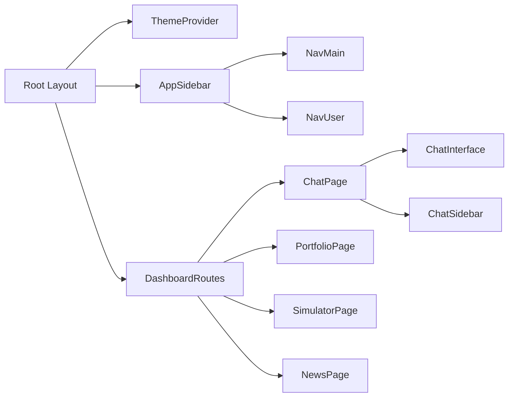

## 4.3 Backend Architecture
The backend is structured into Hono modules, each providing routes, controllers, and services. This separation reduces coupling and improves maintainability.

**Figure 3: Backend Module Diagram**

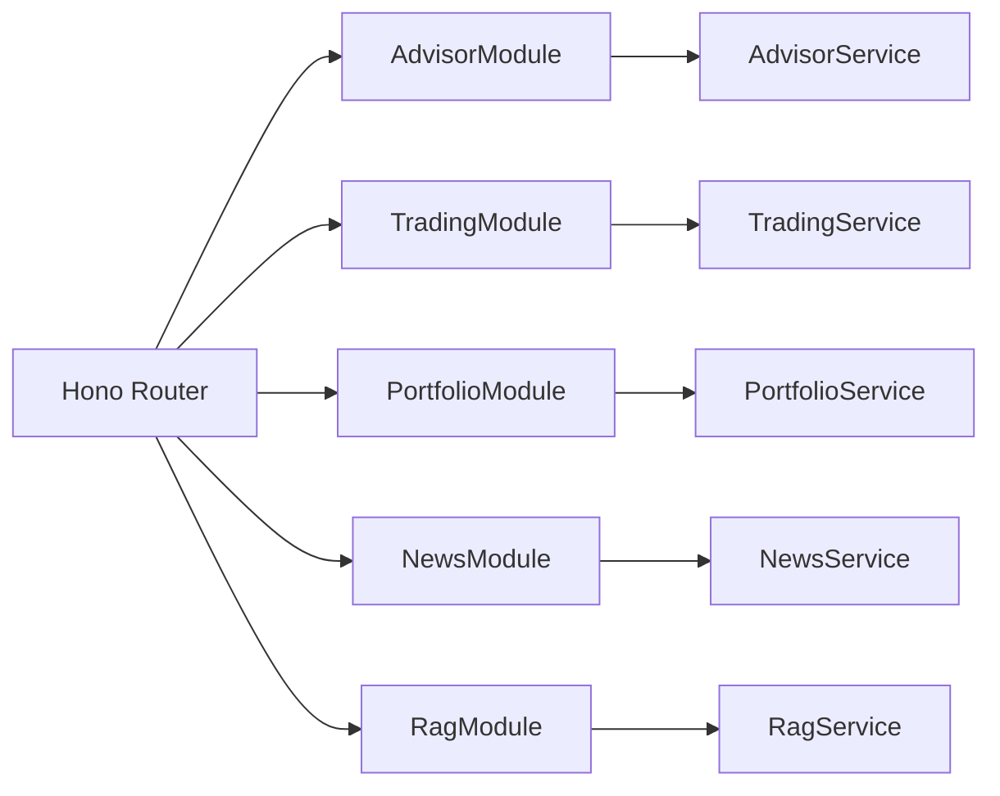

## 4.4 Data Layer Design
The Prisma schema models core entities including users, sessions, portfolios, simulator data, and AI chat sessions. RAG data is stored in a dedicated `document_embeddings` table with metadata and a pgvector index.

**Table 9: Data Entities and Purpose**

| Entity | Purpose |
| --- | --- |
| User | Core identity and profile data |
| Session | Authentication sessions |
| Portfolio | Real portfolio information |
| Holding | Real holdings per asset |
| SimulatorProfile | Virtual trading profile |
| SimulatorTransaction | Virtual trades and pending orders |
| AiChatSession | Chat session grouping |
| AiChatMessage | Individual chat messages |
| NewsArticle | Market news items |

**Figure 9: Database ER Diagram**

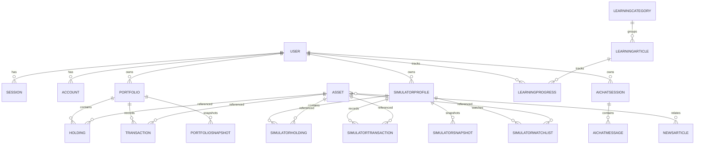

### 4.4.1 Data Dictionary (Selected Tables)

**User**
- id (String, cuid)
- name (String)
- email (String, unique)
- emailVerified (Boolean)
- image (String, nullable)
- createdAt, updatedAt (DateTime)
- twoFactorEnabled, role, banned, banReason, banExpires (nullable)

**Portfolio**
- id (String, cuid)
- userId (FK to User)
- name (String)
- description (String, nullable)
- cashBalance (Decimal)
- createdAt, updatedAt (DateTime)

**Holding**
- id (String, cuid)
- portfolioId (FK to Portfolio)
- assetId (FK to Asset)
- quantity (Decimal)
- averageBuyPrice (Decimal)

**SimulatorTransaction**
- id (String, cuid)
- profileId (FK to SimulatorProfile)
- assetId (FK to Asset)
- type (BUY/SELL)
- quantity (Decimal)
- pricePerUnit (Decimal)
- executedAt (DateTime, nullable)
- pending (Boolean)

**AiChatSession**
- id (String, cuid)
- userId (FK to User)
- title (String)
- createdAt, updatedAt (DateTime)

**AiChatMessage**
- id (String, cuid)
- sessionId (FK to AiChatSession)
- role (USER/MODEL)
- content (String)
- sources (String array)
- createdAt (DateTime)

**InvestorProfile**
- id (String, cuid)
- userId (FK to User)
- riskTolerance, investmentGoal, investmentHorizon (String)
- experienceLevel (String)
- preferredSectors (String array)

**NewsArticle**
- id (String, cuid)
- title, description, url, sourceName (String)
- publishedAt (DateTime)
- sentiment (enum)

## 4.5 API Design and Routing
Hono routes are mapped under `/api` and exposed through Next.js. Each module has its own endpoints. The API is designed to be REST-like with JSON responses and SSE for streaming.

**Table 5: Module-to-API Mapping**

| Module | Base Path | Example Endpoints |
| --- | --- | --- |
| Advisor | `/api/advisor` | `/chat`, `/chat/stream`, `/sessions` |
| Trading | `/api/trading` | `/simulator/trade`, `/market/quote/:symbol` |
| Portfolio | `/api/portfolio` | `/overview`, `/performance` |
| News | `/api/news` | `/market`, `/personalized` |
| RAG | `/api/rag` | `/ingest/:ticker`, `/search` |

**Figure 10: API Gateway Flow (Next.js + Hono)**

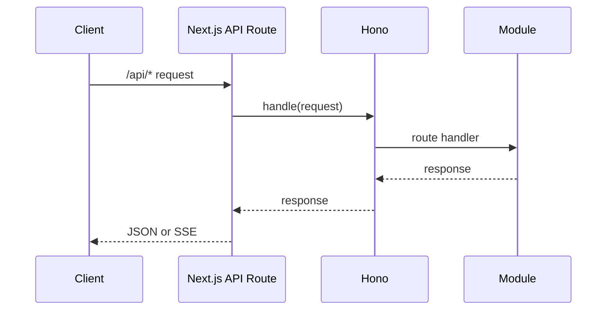

## 4.6 Authentication and Authorization Flow
Next.js middleware enforces route protection for `/dashboard`, while Hono middleware validates sessions on private API routes.

**Figure 4: Authentication Sequence Diagram**

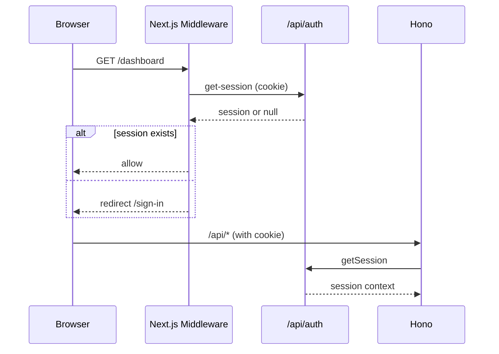

## 4.7 State Management and Caching
- React local state handles UI state transitions.
- SWR caches API requests and revalidates periodically.
- Redis provides TTL-based caching to reduce provider calls.

**Table 7: Rate Limit and Cache Settings**

| Cache Key | TTL | Rationale |
| --- | --- | --- |
| Quote | 15s | Near real-time pricing |
| Candles | 5m | Historical data stability |
| Company Profile | 24h | Rarely changes |
| Search | 1h | Reduce provider calls |

## 4.8 RAG Pipeline Design
The RAG pipeline performs the following steps: fetch source data, chunk text, generate embeddings, store embeddings in pgvector, and perform similarity search with metadata filters.

**Figure 6: RAG Ingestion Pipeline Flowchart**

```mermaid
flowchart TD
  Start([Start]) --> Fetch[Fetch profile, news, financials, SEC]
  Fetch --> Normalize[Normalize and chunk text]
  Normalize --> Embed[Generate embeddings (Gemini or local fallback)]
  Embed --> Store[Insert into document_embeddings]
  Store --> Index[IVFFlat index for cosine similarity]
  Index --> Done([Done])
```

**Figure 14: RAG Search and Rerank Flow**

```mermaid
flowchart TD
  Query([User Query]) --> Expand[Query expansion + intent hints]
  Expand --> Embed[Generate query embedding]
  Embed --> VectorSearch[match_documents in pgvector]
  VectorSearch --> Filter[Metadata filter (ticker, source)]
  Filter --> Rerank[Hybrid reranking]
  Rerank --> TopK[Top-K documents]
  TopK --> Prompt[Inject into system prompt]
```

## 4.9 Algorithm Design and Data Processing
Portfolio metrics and RAG ranking rely on explicit formulas.

**Portfolio PnL:**  
$PnL = (P_{current} - P_{avg}) * Q$  
$PnL\% = \frac{PnL}{P_{avg} * Q} * 100$

**RAG reranking score:**

$Score = 0.55 * S_{vector} + 0.20 * S_{keyword} + 0.10 * S_{recency} + 0.15 * S_{secBoost}$

**Table 10: RAG Retrieval Scoring Components**

| Component | Description |
| --- | --- |
| $S_{vector}$ | Cosine similarity from pgvector search |
| $S_{keyword}$ | Token overlap score |
| $S_{recency}$ | Exponential decay based on age |
| $S_{secBoost}$ | SEC filing relevance boost |

## 4.10 Deployment Architecture
The deployment model assumes a Next.js environment with serverless API routes. Hono runs inside the Next.js route adapter.

**Figure 8: Deployment Diagram**

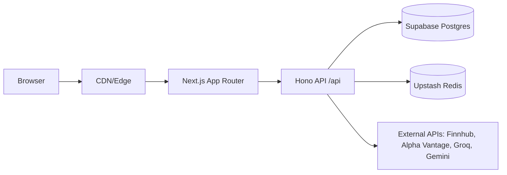

## 4.11 Security Design
- Session-based authentication with Better Auth.
- Server-side checks in Hono middleware to protect private routes.
- API keys and secrets stored in environment variables.

## 4.12 UI/UX Design Principles
- Dashboard-first navigation for rapid feature access.
- Clear visual separation of modules: advisor, portfolio, simulator, news.
- Responsive layout with sidebar collapse support.
- Strong feedback loops (toasts, loading states, streaming indicators).

---

# 5. IMPLEMENTATION

## 5.1 Project Setup and Repository Structure
The repository structure separates frontend, backend, and shared components:

```
app/
  dashboard/
  api/[...route]/route.ts
server/
  modules/
  services/
  prisma/
components/
lib/
```

## 5.2 Next.js App Router and Layouts
The root layout configures typography and theme providers. The dashboard layout injects the sidebar for all dashboard routes.

```ts
// app/dashboard/layout.tsx
<SidebarProvider>
  <AppSidebar />
  {children}
</SidebarProvider>
```

## 5.3 Hono Integration with Next.js
The API route delegates to Hono, ensuring all REST endpoints share common middleware and routing logic.

```ts
// app/api/[...route]/route.ts
import app from "@/server";
import { handle } from "hono/vercel";
export const GET = handle(app);
export const POST = handle(app);
```

## 5.4 Authentication Implementation
Better Auth is configured with Prisma and provides session APIs. Next.js middleware calls `/api/auth/get-session` to protect the dashboard.

```ts
// server/lib/auth.ts
export const auth = betterAuth({
  database: prismaAdapter(prisma, { provider: "postgresql" }),
  emailAndPassword: { enabled: true },
});
```

```ts
// middleware.ts
if (!session) {
  return NextResponse.redirect(new URL("/sign-in", request.url));
}
```

## 5.5 AI Advisor and Chat Streaming
The AI advisor builds a system prompt with portfolio context, investor profile, and RAG sources. Responses are streamed with SSE.

```ts
// server/modules/advisor/controller.ts
const stream = new ReadableStream({
  async start(controller) {
    const messageStream = await advisorService.sendMessageStream(...);
    for await (const chunk of messageStream.stream) {
      controller.enqueue(encode(`data: ${JSON.stringify({ type: "chunk", content: chunk })}`));
    }
  },
});
```

**Figure 5: AI Advisor Streaming Sequence Diagram**

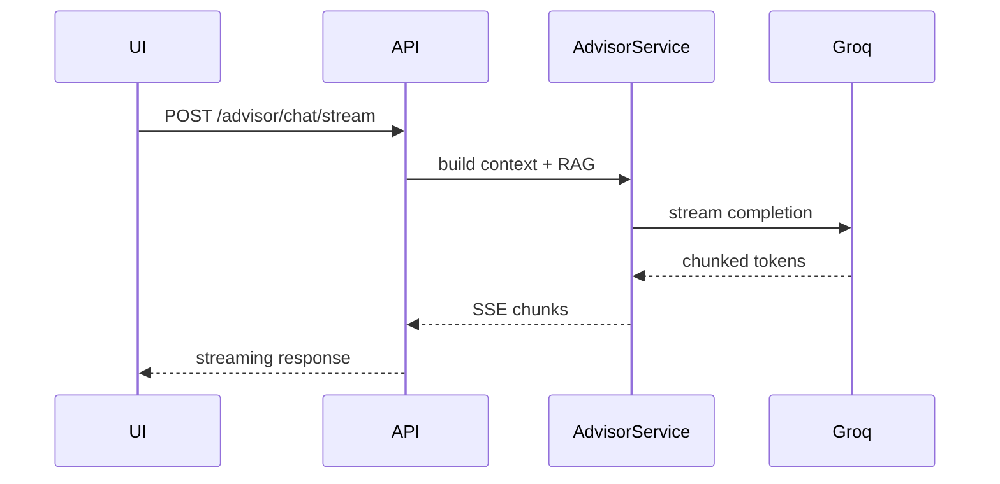

### 5.5.1 System Prompt Construction
The advisor service builds a system prompt that encodes tone and compliance rules, then appends portfolio and investor profile data. A missing profile triggers a short prompt asking the user to complete it.

```ts
// server/modules/advisor/service.ts (excerpt)
if (!hasInvestorProfile || profileNeedsCompletion) {
  systemPrompt += "\n\n## PROFILE COMPLETION RULE: ...";
}
```

### 5.5.2 Session Persistence
Each user message is saved to the `AiChatMessage` table before the LLM response is generated. After the response completes, the AI message is saved with serialized source metadata. This ensures reproducibility of advice and supports chat history in the sidebar.

```ts
await prisma.aiChatMessage.create({
  data: { sessionId: session.id, role: "USER", content: userMessage }
});
```
```

The chat interface uses `advisorApi.sendMessageStream` to parse SSE events and render streaming output. Source metadata is stored in each message for later display.

## 5.6 RAG Ingestion and Retrieval
RAG ingestion is implemented in `server/modules/rag/service.ts`. Data sources include company profiles, news, financials, and SEC filings. Embeddings are generated with Gemini or a local hash fallback.

```ts
// server/modules/rag/service.ts
const result = await model.embedContent(text);
const embedding = result.embedding.values;
```

Vector data is stored in a 768-dimensional pgvector table:

```sql
CREATE TABLE document_embeddings (
  id UUID PRIMARY KEY DEFAULT gen_random_uuid(),
  content TEXT NOT NULL,
  embedding VECTOR(768)
);
```
### 5.6.1 Document Chunking Strategy
The ingestion service uses a recursive text splitter with overlaps to preserve context across chunks. This reduces information loss for long SEC filings and improves retrieval quality.

```ts
// server/modules/rag/service.ts
const splitter = new RecursiveCharacterTextSplitter({
  chunkSize: 1000,
  chunkOverlap: 200,
});
```

### 5.6.2 SEC Filing Processing
SEC filings are parsed, normalized, and sectioned using regex-based headers. This allows the system to prioritize specific parts of filings such as risk factors.

```ts
const headingRegex = /(Item\s+\d{1,2}[A-Z]?\.?\s*[-:])+/gi;
```

### 5.6.3 Fallback Embeddings
When `GEMINI_API_KEY` is missing or embedding calls fail, the service falls back to a local hashing-based embedding. This maintains basic similarity search functionality for development, while documenting the limitation.

## 5.7 Trading Simulator Implementation
Simulator trades are executed immediately if markets are open, or stored as pending orders otherwise. Pending orders are processed at startup and on demand.

```ts
// server/modules/trading/service.ts
if (isMarketOpen === false) {
  return prisma.simulatorTransaction.create({ pending: true, ... });
}
```

**Figure 7: Trading Simulator Order Lifecycle**

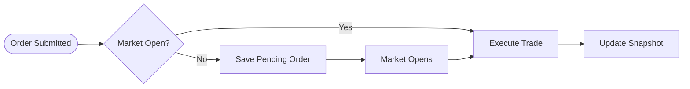

**Figure 13: Pending Order Processing Flow**

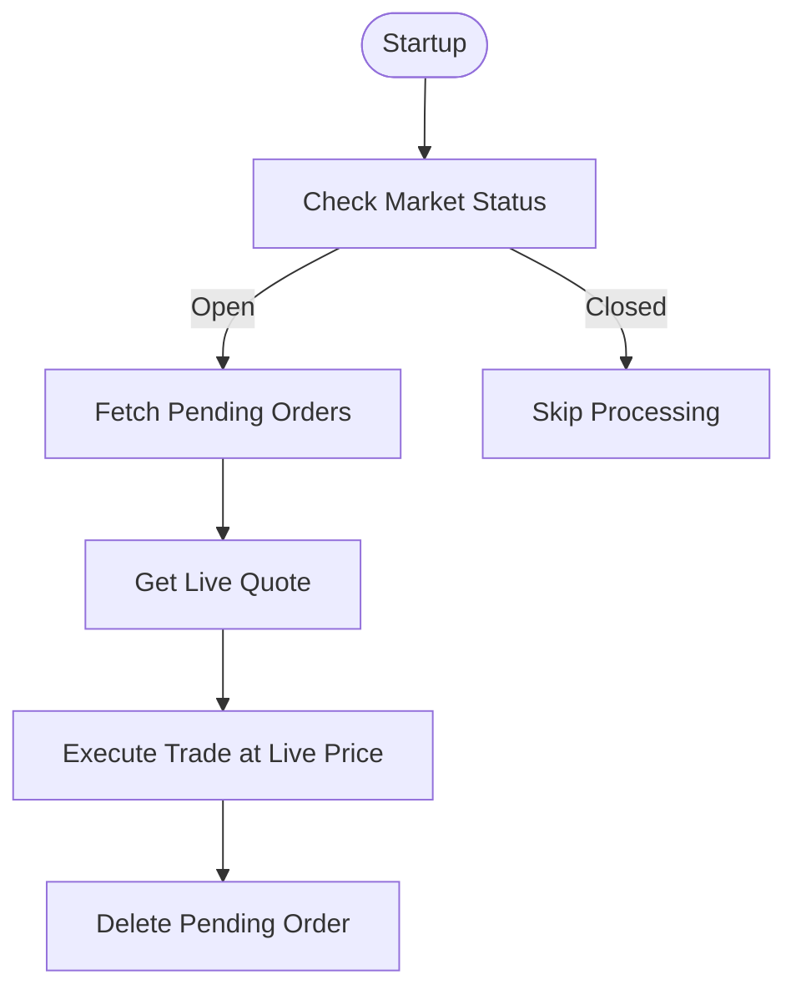

## 5.8 Portfolio Analytics Implementation
Portfolio analytics calculate total value, PnL, and sector allocation. Data is enriched with live quotes.

```ts
// server/modules/portfolio/service.ts
const currentPrice = quote?.c || 0;
const totalValue = currentPrice * quantity;
```

**Figure 12: Portfolio Analytics Data Flow**

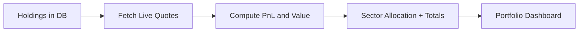

### 5.8.1 Sector Allocation Logic
Sector allocation is computed by aggregating holding values by exchange (used as a proxy). This design keeps analytics functional even when sector metadata is missing, and can be upgraded later to true sector fields.

### 5.8.2 Insights and Recommendations
Portfolio insights combine analyst recommendations, basic financial metrics, and peer comparisons. The service calls multiple endpoints and merges results into a single response for the dashboard and advisor.

## 5.9 Market News and Data Integration
News service uses Alpha Vantage as primary source with Finnhub fallback and synthetic data if both fail. Personalized feeds incorporate holdings and watchlist symbols.

```ts
// server/modules/news/service.ts
const newsData = await alphaVantageService.getNewsSentiment({
  sort: "LATEST",
  limit: 50,
  time_from,
});
```

**Figure 11: News Personalization Flow**

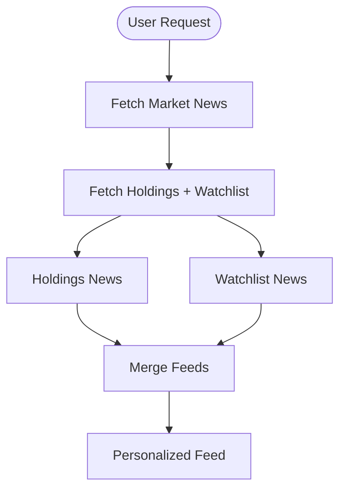

## 5.10 UI Components and Visualization
The UI uses Recharts for performance charts, a custom holdings table, and a simulator panel with tabs for portfolio, trade, and research. The chat interface uses Markdown rendering and copy-to-clipboard interactions with confetti effects.

## 5.11 Error Handling and Observability
Controllers wrap logic in try/catch blocks and return consistent JSON error structures. Logs are emitted for failed API calls and fallbacks, improving traceability during development.

## 5.12 Performance Optimization
- Redis caching for quotes, candles, and profiles.
- Short-lived cache for market data to balance freshness and rate limits.
- LLM context truncated to the last 20 messages.
- RAG ingestion cooldown to reduce redundant embeddings.

## 5.13 Security Implementation
- Session validation on all private API routes.
- Cookie-based authentication enforced by middleware.
- Secrets and keys stored in environment variables.

## 5.14 Deployment and Configuration
The deployment scripts in `package.json` support development and production builds.

**Table 12: Deployment Commands and Scripts**

| Script | Purpose |
| --- | --- |
| `npm run dev` | Start dev server |
| `npm run build` | Build Next.js project |
| `npm run prisma:migrate` | Apply DB migrations |

---

# 6. TESTING AND EVALUATION

## 6.1 Testing Strategy
Testing focused on end-to-end validation of key modules: AI advisor, RAG ingestion, simulator trades, and portfolio analytics. Formal unit tests are planned but not yet implemented.

## 6.2 Unit and Integration Testing
Although no automated unit suite exists, core services were manually validated by invoking API endpoints and inspecting results.

## 6.3 API Testing and Smoke Tests
The repository includes a RAG smoke test script that verifies database prerequisites, ingestion, and search results.

```powershell
Invoke-RestMethod -Method Post -Uri "$BaseUrl/api/rag/ingest/$Ticker"
Invoke-RestMethod -Method Get -Uri "$BaseUrl/api/rag/ingest/status/$Ticker"
```

## 6.4 UI Testing and Usability Checks
Manual UI checks verified:
- Streaming messages in chat.
- Portfolio refresh and PnL rendering.
- Simulator order placement and holdings updates.

**Table 13: Manual UI Verification Checklist**

| Feature | Expected Result |
| --- | --- |
| Chat streaming | Response appears incrementally |
| Chat history | Sessions load in sidebar |
| Portfolio refresh | Data revalidates |
| Simulator trade | Holdings update |

## 6.5 Performance and Rate-Limit Evaluation
Caching was validated by observing fewer provider calls under repeated queries. Alpha Vantage and Finnhub rate limits were mitigated through Redis TTLs and fallback logic.

## 6.6 Security Validation
Private endpoints return 401 when sessions are missing. Middleware redirects unauthenticated users to `/sign-in`.

## 6.7 Debugging and Bug Fixing Summary
Documented fixes include chat history loading, markdown rendering, duplicate responses, auto-scroll reliability, and session selection stability.

## 6.8 Evaluation Metrics and Results
**Table 6: Test Cases and Results**

| Test Case | Expected Result | Outcome |
| --- | --- | --- |
| RAG ingestion for AAPL | Chunks inserted into vector DB | Passed |
| Chat SSE streaming | Real-time incremental responses | Passed |
| Pending order processing | Orders executed when market open | Passed |
| Portfolio overview API | Returns holdings with PnL | Passed |

---

# 7. CONCLUSION AND FUTURE WORK

## 7.1 Project Achievements
WealthFlow successfully integrates portfolio analytics, trading simulation, and a RAG-powered AI advisor in a single platform. The system demonstrates a feasible architecture for combining modern LLM capabilities with real financial context.

## 7.2 Lessons Learned
- RAG quality depends on robust ingestion and metadata filtering.
- Streaming responses significantly improve perceived performance.
- Caching and rate control are critical for API-driven fintech systems.

## 7.3 Limitations
- Learning hub is primarily UI scaffolding without a full content pipeline.
- Embeddings rely on external availability of Gemini or fallback hashing.
- API rate limits constrain large-scale usage without paid plans.

## 7.4 Future Enhancements
- Implement automated LLM evaluation and feedback loops.
- Add summarization for long chat histories.
- Extend learning module with dynamic content ingestion.
- Incorporate portfolio optimization algorithms and risk models.

## 7.5 Research Opportunities
- Evaluate hybrid semantic and symbolic retrieval for finance.
- Study the impact of RAG on financial decision-making accuracy.

---

# REFERENCES

[1] Vercel, "Next.js Documentation," 2026. [Online]. Available: https://nextjs.org/docs

[2] Meta, "React Documentation," 2026. [Online]. Available: https://react.dev

[3] Hono, "Hono - Ultrafast Web Framework," 2026. [Online]. Available: https://hono.dev

[4] Supabase, "Supabase PostgreSQL Platform," 2026. [Online]. Available: https://supabase.com

[5] Prisma, "Prisma ORM Documentation," 2026. [Online]. Available: https://www.prisma.io/docs

[6] Better Auth, "Better Auth Documentation," 2026. [Online]. Available: https://better-auth.com

[7] Groq, "Groq API Documentation," 2026. [Online]. Available: https://console.groq.com/docs

[8] PGVector, "pgvector Extension for PostgreSQL," 2026. [Online]. Available: https://github.com/pgvector/pgvector

[9] PostgreSQL Global Development Group, "PostgreSQL Documentation," 2026. [Online]. Available: https://www.postgresql.org/docs

[10] Betterment, "Betterment Robo-Advisors Overview," 2026. [Online]. Available: https://www.betterment.com

[11] Wealthfront, "Wealthfront Portfolio Automation," 2026. [Online]. Available: https://www.wealthfront.com

[12] P. Lewis et al., "Retrieval-Augmented Generation for Knowledge-Intensive NLP Tasks," in *Advances in Neural Information Processing Systems*, 2020.

[13] Google, "Gemini API and Embeddings Documentation," 2026. [Online]. Available: https://ai.google.dev

[14] Upstash, "Upstash Redis Documentation," 2026. [Online]. Available: https://upstash.com/docs/redis

[15] Finnhub, "Finnhub Market Data API," 2026. [Online]. Available: https://finnhub.io/docs/api

[16] Alpha Vantage, "Alpha Vantage API Documentation," 2026. [Online]. Available: https://www.alphavantage.co/documentation/

[17] SWR, "SWR React Hooks for Data Fetching," 2026. [Online]. Available: https://swr.vercel.app

[18] Zod, "Zod Schema Validation," 2026. [Online]. Available: https://zod.dev

[19] Framer Motion, "Framer Motion Documentation," 2026. [Online]. Available: https://www.framer.com/motion/

[20] Tailwind CSS, "Tailwind CSS Documentation," 2026. [Online]. Available: https://tailwindcss.com/docs

[21] MDN Web Docs, "Server-Sent Events," 2026. [Online]. Available: https://developer.mozilla.org/en-US/docs/Web/API/Server-sent_events

[22] LangChain, "Text Splitters Documentation," 2026. [Online]. Available: https://js.langchain.com/docs/modules/data_connection/document_transformers

---

# APPENDICES

## Appendix A: Installation Guide (Condensed)

1. Install dependencies:

```bash
npm install
```

2. Configure environment variables:

```env
DATABASE_URL=...
DIRECT_URL=...
BETTER_AUTH_SECRET=...
BETTER_AUTH_URL=http://localhost:3000
NEXT_PUBLIC_API_URL=http://localhost:3000
GROQ_API_KEY=...
GEMINI_API_KEY=...
FINNHUB_API_KEY=...
ALPHA_VANTAGE_API_KEY=...
UPSTASH_REDIS_REST_URL=...
UPSTASH_REDIS_REST_TOKEN=...
```

3. Prisma setup:

```bash
npm run prisma:generate
npm run prisma:migrate
```

4. Start development server:

```bash
npm run dev
```

## Appendix B: API Endpoints (Summary)

- `/api/advisor/chat` (POST)
- `/api/advisor/chat/stream` (POST)
- `/api/advisor/sessions` (GET/POST)
- `/api/advisor/sessions/:id` (GET/DELETE)
- `/api/advisor/investor-profile` (GET/PUT)
- `/api/trading/simulator/*` (POST/GET)
- `/api/trading/market/*` (GET)
- `/api/portfolio/*` (GET/POST/PATCH/DELETE)
- `/api/news/*` (GET)
- `/api/rag/ingest` (POST)
- `/api/rag/search` (POST)

## Appendix C: RAG SQL Initialization

```sql
CREATE EXTENSION IF NOT EXISTS vector;
CREATE TABLE IF NOT EXISTS document_embeddings (
  id UUID PRIMARY KEY DEFAULT gen_random_uuid(),
  content TEXT NOT NULL,
  embedding VECTOR(768),
  metadata JSONB DEFAULT '{}'::jsonb,
  document_type VARCHAR(50),
  source_url TEXT,
  created_at TIMESTAMP DEFAULT NOW(),
  updated_at TIMESTAMP DEFAULT NOW()
);
```

## Appendix D: UI Screenshot References (To Capture)

- Dashboard home (Route: `/dashboard`)
- AI Advisor chat (Route: `/dashboard/chat`)
- Portfolio overview (Route: `/dashboard/portfolio`)
- Trading simulator (Route: `/dashboard/simulator`)
- Market news (Route: `/dashboard/news`)
CREATE TABLE IF NOT EXISTS document_embeddings (
  id UUID PRIMARY KEY DEFAULT gen_random_uuid(),
  content TEXT NOT NULL,
  embedding VECTOR(768),
  metadata JSONB DEFAULT '{}'::jsonb,
  document_type VARCHAR(50),
  source_url TEXT,
  created_at TIMESTAMP DEFAULT NOW(),
  updated_at TIMESTAMP DEFAULT NOW()
);
```

## Appendix E: UI Screenshot References (To Capture)

- Dashboard home (Route: `/dashboard`)
- AI Advisor chat (Route: `/dashboard/chat`)
- Portfolio overview (Route: `/dashboard/portfolio`)
- Trading simulator (Route: `/dashboard/simulator`)
- Market news (Route: `/dashboard/news`)
```sql
CREATE EXTENSION IF NOT EXISTS vector;
CREATE TABLE IF NOT EXISTS document_embeddings (
  id UUID PRIMARY KEY DEFAULT gen_random_uuid(),
  content TEXT NOT NULL,
  embedding VECTOR(768),
  metadata JSONB DEFAULT '{}'::jsonb,
  document_type VARCHAR(50),
  source_url TEXT,
  created_at TIMESTAMP DEFAULT NOW(),
  updated_at TIMESTAMP DEFAULT NOW()
);
```

## Appendix D: UI Screenshot References (To Capture)

- Dashboard home (Route: `/dashboard`)
- AI Advisor chat (Route: `/dashboard/chat`)
- Portfolio overview (Route: `/dashboard/portfolio`)
- Trading simulator (Route: `/dashboard/simulator`)
- Market news (Route: `/dashboard/news`)
- Trading simulator (Route: `/dashboard/simulator`)
- Market news (Route: `/dashboard/news`)
### F.2 Trading Module

**POST /api/trading/simulator/initialize**
- Creates simulator profile (100k virtual balance)

**GET /api/trading/simulator/profile**
- Returns profile, holdings, and total value

**POST /api/trading/simulator/trade**
- Executes buy/sell trade, may create pending order

**GET /api/trading/simulator/holdings**
- Returns holdings with live prices and PnL

**GET /api/trading/simulator/history**
- Transaction history with filters (assetId, type, from, to)

**POST /api/trading/simulator/snapshot**
- Creates daily snapshot

**GET /api/trading/simulator/snapshots**
- Returns snapshot series for charts

**POST /api/trading/simulator/watchlist**
- Adds asset to watchlist with optional alert target

**GET /api/trading/simulator/watchlist**
- Returns watchlist

**PATCH /api/trading/simulator/watchlist/:id**
- Updates alert settings

**DELETE /api/trading/simulator/watchlist/:id**
- Removes watchlist item

**GET /api/trading/market/quote/:symbol**
- Real-time quote

**GET /api/trading/market/candles/:symbol**
- OHLCV time series

**GET /api/trading/market/search?q=**
- Symbol search

**GET /api/trading/market/profile/:symbol**
- Company profile

### F.3 Portfolio Module

**GET /api/portfolio/overview**
- Portfolio summary with holdings and analytics

**GET /api/portfolio/performance?days=30**
- Time series for performance charts

**GET /api/portfolio/insights**
- Analyst recommendations and financial metrics

**GET /api/portfolio/news?days=7**
- Aggregated news for holdings

**POST /api/portfolio/holdings**
- Add holding (symbol, quantity, averagePrice)

**PATCH /api/portfolio/holdings/:id**
- Update holding

**DELETE /api/portfolio/holdings/:id**
- Remove holding

### F.4 News Module

**GET /api/news/market?category=general**
- General market news

**GET /api/news/personalized?days=7**
- Personalized feed from holdings and watchlist

**GET /api/news/trending?limit=10**
- Trending stocks

**GET /api/news/earnings?days=30**
- Earnings for holdings

### F.5 RAG Module

**POST /api/rag/ingest/:ticker**
- Ingests context for a ticker

**POST /api/rag/ingest**
- Batch ingestion for multiple tickers

**GET /api/rag/ingest/status/:ticker**
- Ingestion status per document type

**POST /api/rag/search**
- Vector search with metadata filters

## Appendix G: Testing Examples (Representative)

**G.1 RAG Smoke Test Output (Representative)**

```
=== RAG smoke test starting ===
Base URL: http://localhost:3000
Ticker: AAPL
API reachable: HTTP 200
Ingested chunks: 34
Top result: sec_filing | form=10-K | section=Item 1A
```

**G.2 News API Test (Representative)**

```
Status: 200
Feed count: 10
First article: Apple announces record Q4 earnings
```
```sql
CREATE EXTENSION IF NOT EXISTS vector;
CREATE TABLE IF NOT EXISTS document_embeddings (
  id UUID PRIMARY KEY DEFAULT gen_random_uuid(),
  content TEXT NOT NULL,
  embedding VECTOR(768),
  metadata JSONB DEFAULT '{}'::jsonb,
  document_type VARCHAR(50),
  source_url TEXT,
  created_at TIMESTAMP DEFAULT NOW(),
  updated_at TIMESTAMP DEFAULT NOW()
);
```

## Appendix D: UI Screenshot References (To Capture)

- Dashboard home (Route: `/dashboard`)
- AI Advisor chat (Route: `/dashboard/chat`)
- Portfolio overview (Route: `/dashboard/portfolio`)
- Trading simulator (Route: `/dashboard/simulator`)
- Market news (Route: `/dashboard/news`)
